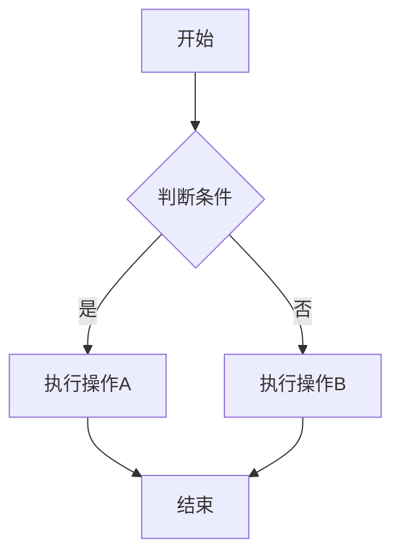

# Markdown 完全指南

欢迎使用本 Markdown 指南！Markdown 是一种轻量级标记语言，让你可以使用易读易写的纯文本格式编写文档。

## 基础语法

### 标题

使用 `#` 符号创建标题，支持 1-6 级：

```markdown
# 一级标题

## 二级标题

### 三级标题
```

### 文本格式

- **粗体**：使用 `**文本**`
- _斜体_：使用 `*文本*`
- ~~删除线~~：使用 `~~文本~~`
- `行内代码`：使用反引号 `` `代码` ``

### 列表

无序列表：

- 项目 1
- 项目 2
  - 子项目 2.1
  - 子项目 2.2

有序列表：

1. 第一步
2. 第二步
3. 第三步

### 链接和图片

链接：[链接文本](https://example.com)

图片：

## 高级用法

### 代码块

使用三个反引号包裹代码，可以指定语言：

```javascript
function hello() {
	console.log("Hello, World!")
}
```

```python
def hello():
    print("Hello, World!")
```

### 表格

| 姓名 | 年龄 | 城市 |
| ---- | ---- | ---- |
| 张三 | 25   | 北京 |
| 李四 | 30   | 上海 |
| 王五 | 28   | 广州 |

### 引用块

> 这是一段引用文本。
>
> 可以有多行引用。

### 分割线

使用三个或更多的短横线、星号或下划线：

---

---

---

### 任务列表

- [x] 已完成任务
- [ ] 待办任务
- [ ] 另一个待办

## 流程图

使用 Mermaid 语法绘制流程图：



## 数学公式

支持 LaTeX 数学公式（需要配置插件）：

行内公式：$E = mc^2$

块级公式：

$$
\int_{a}^{b} f(x) dx = F(b) - F(a)
$$

## 最佳实践

1. **保持简洁**：使用简单的语法，避免过度嵌套
2. **添加空行**：在块级元素之间添加空行
3. **使用注释**：在复杂 Markdown 中使用 HTML 注释
4. **预览检查**：使用编辑器实时预览功能
5. **版本控制**：将 Markdown 文档纳入 Git 管理

## 常用工具

- **编辑器**：VS Code、Typora、Obsidian
- **在线预览**：StackEdit、Dillinger
- **转换工具**：Pandoc、markdown-it

## 参考资源

- [Markdown 官方规范](https://commonmark.org/)
- [GitHub Flavored Markdown](https://github.github.com/gfm/)
- [Mermaid 文档](https://mermaid.js.org/intro/)

---

**提示**：本编辑器支持实时预览，您可以一边编辑一边查看效果！
