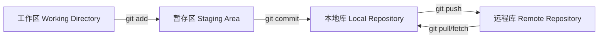
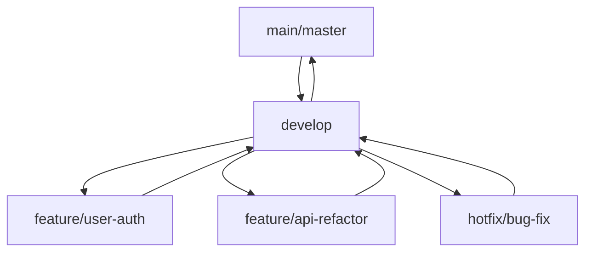

# Git 工作流最佳实践

本文档介绍 Git 的核心概念、常用命令和团队协作工作流。

## 基础概念

### Git 三大区域



- **工作区**：当前修改的文件
- **暂存区**：准备提交的修改
- **本地库**：本地的提交历史
- **远程库**：远程服务器的代码库

### 常用命令速查

```bash
# 初始化仓库
git init

# 克隆仓库
git clone <url>

# 查看状态
git status

# 添加到暂存区
git add <file>
git add .              # 所有文件
git add -A             # 包括删除的文件

# 提交
git commit -m "message"

# 查看历史
git log
git log --oneline      # 简洁显示
git log --graph        # 图形化显示

# 推送到远程
git push origin <branch>

# 拉取远程更新
git pull origin <branch>
```

## 分支管理

### 分支策略



### 分支操作

```bash
# 创建分支
git branch feature/login
git checkout -b feature/login  # 创建并切换

# 查看分支
git branch               # 本地分支
git branch -r           # 远程分支
git branch -a           # 所有分支

# 切换分支
git checkout <branch>
git switch <branch>     # Git 2.23+

# 合并分支
git merge feature/login

# 删除分支
git branch -d feature/login      # 已合并
git branch -D feature/login      # 强制删除
```

## Git Flow 工作流

### 主要分支

- **main/master**：生产环境代码
- **develop**：开发环境代码
- **feature/***：新功能开发
- **release/***：发布准备
- **hotfix/***：生产紧急修复

### 工作流程

```bash
# 1. 从 develop 创建功能分支
git checkout develop
git pull origin develop
git checkout -b feature/new-feature

# 2. 开发并提交
git add .
git commit -m "feat: add new feature"

# 3. 推送功能分支
git push origin feature/new-feature

# 4. 创建 Pull Request/Merge Request

# 5. 合并到 develop 后删除分支
git checkout develop
git pull origin develop
git branch -d feature/new-feature
```

## 提交规范

### Conventional Commits

```
<type>(<scope>): <subject>

<body>

<footer>
```

### Type 类型

| Type | 说明 | 示例 |
|-------|------|--------|
| feat | 新功能 | feat: add user authentication |
| fix | 修复 bug | fix: resolve login issue |
| docs | 文档更新 | docs: update API guide |
| style | 代码格式 | style: format code with prettier |
| refactor | 重构 | refactor: simplify user service |
| perf | 性能优化 | perf: optimize database queries |
| test | 测试 | test: add unit tests for auth |
| chore | 构建/工具 | chore: update dependencies |

### 示例

```bash
feat(auth): add OAuth2 login support

- Add Google OAuth provider
- Add GitHub OAuth provider
- Update login UI to support social login

Closes #123
```

## 冲突解决

### 查看冲突

```bash
# 拉取时检测到冲突
git pull origin develop

# 查看冲突文件
git status
# On branch feature/login
# You have unmerged paths.
# both modified: src/components/Login.vue
```

### 解决冲突

```vue
<!-- 冲突标记 -->
<<<<<<< HEAD
const login = async () => {
  // 当前分支的代码
}
=======
const login = async () => {
  // 合并分支的代码
}
>>>>>>> feature/new-auth

<!-- 解决后 -->
const login = async () => {
  // 合并后的代码
}
```

```bash
# 标记为已解决
git add src/components/Login.vue

# 提交合并
git commit -m "fix: resolve merge conflicts in Login.vue"

# 推送
git push origin feature/login
```

## 标签管理

### 创建标签

```bash
# 轻量标签
git tag v1.0.0

# 附注标签（推荐）
git tag -a v1.0.0 -m "Release version 1.0.0"

# 推送标签
git push origin v1.0.0
git push origin --tags    # 所有标签
```

### 查看标签

```bash
git tag                    # 列出标签
git show v1.0.0          # 查看标签详情
git tag -l "v1.*"        # 匹配标签
```

## 暂存和储藏

### 暂存未提交的修改

```bash
# 暂存当前工作
git stash

# 暂存并添加说明
git stash save "work in progress"

# 查看暂存列表
git stash list

# 恢复暂存
git stash pop

# 应用暂存但不删除
git stash apply

# 删除暂存
git stash drop
```

### 使用场景

```bash
# 场景：开发到一半需要切换分支
git add -A
git commit -m "WIP: temporary commit"
git checkout other-branch

# 更好的方式：使用 stash
git stash
git checkout other-branch
# ... 其他工作 ...
git checkout previous-branch
git stash pop
```

## 回退操作

### 撤销提交

```bash
# 撤销最后一次提交（保留修改）
git reset --soft HEAD~1

# 撤销最后一次提交（不保留修改）
git reset --hard HEAD~1

# 撤销特定提交
git reset --hard <commit-hash>
```

### 回退远程分支

```bash
# 强制推送（谨慎使用）
git push origin main --force

# 更安全的强制推送
git push origin main --force-with-lease
```

### 撤销已推送的提交

```bash
# 使用 revert 创建新提交
git revert <commit-hash>
git push origin main
```

## 历史查看

### 查看提交历史

```bash
# 查看完整历史
git log

# 简洁显示
git log --oneline

# 图形化显示
git log --graph --oneline --all

# 查看特定文件的历史
git log --follow -- src/utils.js

# 查看修改内容
git show <commit-hash>
git diff HEAD~1 HEAD
```

### 查找提交

```bash
# 搜索提交信息
git log --grep="bug fix"

# 搜索修改内容
git log -S="functionName"

# 按作者搜索
git log --author="张三"
```

## 远程仓库管理

### 添加远程仓库

```bash
# 添加远程仓库
git remote add origin https://github.com/user/repo.git

# 查看远程仓库
git remote -v

# 修改远程 URL
git remote set-url origin https://github.com/user/new-repo.git

# 删除远程仓库
git remote remove origin
```

### 同步远程分支

```bash
# 获取所有远程分支
git fetch --all

# 获取并合并
git pull origin main

# 仅获取不合并
git fetch origin
```

## 忽略文件

### .gitignore 配置

```gitignore
# Node modules
node_modules/

# 构建产物
dist/
build/
*.log

# IDE 配置
.vscode/
.idea/

# 环境变量
.env
.env.local

# 操作系统
.DS_Store
Thumbs.db

# 临时文件
*.tmp
*.swp
```

### 已跟踪文件的处理

```bash
# 停止跟踪已提交的文件
git rm --cached filename

# 停止跟踪目录
git rm -r --cached directory/

# 更新 .gitignore 后清理缓存
git rm -r --cached .
git add .
git commit -m "chore: update gitignore"
```

## 团队协作

### Pull Request/Merge Request

```bash
# 1. 创建功能分支
git checkout -b feature/new-feature develop

# 2. 开发并提交
git commit -m "feat: add new feature"

# 3. 推送分支
git push origin feature/new-feature

# 4. 在 GitHub/GitLab 创建 PR

# 5. 代码审查和讨论

# 6. 合并后删除分支
git checkout develop
git pull origin develop
git branch -d feature/new-feature
git push origin --delete feature/new-feature
```

### 代码审查清单

- [ ] 代码符合项目规范
- [ ] 添加了必要的测试
- [ ] 更新了相关文档
- [ ] 没有引入新的 lint 错误
- [ ] 通过所有 CI 检查
- [ ] 没有敏感信息泄露

## 高级技巧

### Cherry-pick

```bash
# 选择特定提交应用到当前分支
git cherry-pick <commit-hash>

# 选择多个提交
git cherry-pick <commit1> <commit2>
```

### Rebase 交互式

```bash
# 交互式变基最近 3 次提交
git rebase -i HEAD~3

# 命令：
# pick - 保留该提交
# reword - 修改提交信息
# edit - 修改提交内容
# squash - 合并到前一个提交
# drop - 删除该提交
```

### Bisect 查找问题

```bash
# 开始二分查找
git bisect start

# 标记当前为有问题的版本
git bisect bad

# 标记已知正常的版本
git bisect good v1.0.0

# Git 会自动切换到中间版本
# 测试后标记：
git bisect good  # 或
git bisect bad   # 或
git bisect skip  # 跳过无法测试的版本

# 完成后重置
git bisect reset
```

## 工具推荐

### GUI 客户端

- **SourceTree**：跨平台 Git GUI
- **GitHub Desktop**：GitHub 官方客户端
- **GitKraken**：现代化的 Git 客户端
- **Fork**：macOS 专用客户端

### VS Code 扩展

- **GitLens**：增强 Git 功能
- **Git Graph**：可视化 Git 历史
- **Git History**：查看文件历史

### 命令行工具

- **gh**：GitHub CLI 工具
- **lazygit**：终端 Git UI
- **tig**：文本模式 Git 浏览器

## 最佳实践

1. **频繁提交**：小步快跑，便于回退
2. **清晰的提交信息**：使用规范格式
3. **分支保护**：主分支需要 PR 审查
4. **CI/CD 集成**：自动化测试和部署
5. **定期同步**：及时拉取远程更新
6. **代码审查**：所有合并需要审查
7. **备份重要分支**：标签发布版本

## 参考资源

- [Pro Git 书籍](https://git-scm.com/book/zh/v2)
- [GitHub 指南](https://guides.github.com/)
- [Conventional Commits](https://www.conventionalcommits.org/)

---

**提示**：掌握 Git 需要大量实践，不要害怕犯错！
