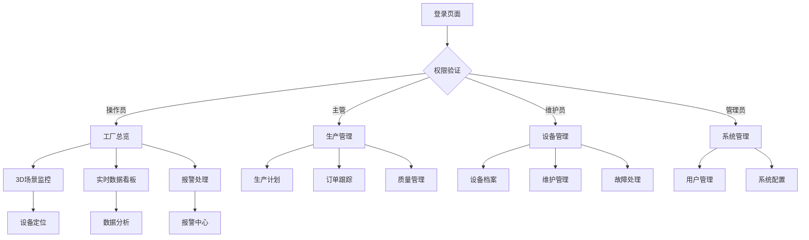

## 1. 产品概述
数字孪生工厂Web前端是一个基于科幻风格设计的工业监控系统，通过3D可视化、实时数据监控和智能分析，帮助工厂管理者全面掌握生产运营状态，提升生产效率和设备管理水平。

产品主要解决传统工厂监控界面单调、数据展示不直观、设备管理分散等问题，为工业4.0智能制造提供现代化的可视化解决方案。

## 2. 核心功能

### 2.1 用户角色
| 角色 | 注册方式 | 核心权限 |
|------|----------|----------|
| 工厂管理员 | 系统管理员分配 | 全系统功能访问、用户管理、系统配置 |
| 生产主管 | 管理员创建 | 生产管理、设备监控、数据分析 |
| 设备维护员 | 管理员创建 | 设备管理、维护计划、故障处理 |
| 操作员 | 管理员创建 | 实时监控、报警处理、数据查看 |
| 访客用户 | 访客模式 | 仅查看公开数据和总览信息 |

### 2.2 功能模块
数字孪生工厂Web前端包含以下核心页面：
1. **工厂总览页面**：3D场景展示、产线状态概览、关键指标看板
2. **设备管理页面**：设备档案、实时监控、维护管理
3. **生产管理页面**：生产计划、执行监控、质量管理
4. **能源管理页面**：能耗监控、能效分析、优化建议
5. **报警中心页面**：实时报警、历史记录、规则配置
6. **数据分析页面**：生产分析、预测分析、报表导出
7. **系统管理页面**：用户管理、权限配置、系统设置

### 2.3 页面详情
| 页面名称 | 模块名称 | 功能描述 |
|----------|----------|----------|
| 工厂总览 | 3D场景控制 | 视角切换（鸟瞰/漫游/定点）、设备高亮显示、分层显示、实时标注 |
| 工厂总览 | 产线状态概览 | 产线运行状态总览表、设备在线状态统计、生产节拍监控、异常报警统计 |
| 工厂总览 | 关键指标看板 | OEE综合效率、产量完成率、设备利用率、质量合格率实时展示 |
| 工厂总览 | 数据可视化 | 产量趋势图、设备状态饼图、报警频次柱状图、能耗监控曲线 |
| 工厂总览 | 热力图分析 | 设备负载、人员分布、能耗分布、故障频率热力图展示 |
| 设备管理 | 设备档案 | 设备台账列表、详细信息查看、图片文档管理、位置标注 |
| 设备管理 | 参数配置 | 运行参数设置、报警阈值配置、维护周期设定、设备分组管理 |
| 设备管理 | 实时监控 | 温度、压力、振动、电流电压、运行速度实时数据表 |
| 设备管理 | 状态分析 | 运行时长统计、开关机记录、负载率分析、效率对比 |
| 设备管理 | 维护管理 | 维护计划列表、工单创建、记录查询、提醒设置 |
| 设备管理 | 故障管理 | 报警列表、详情查看、处理记录、统计分析 |
| 生产管理 | 生产计划 | 计划列表、排产界面、调整记录、完成率统计 |
| 生产管理 | 订单跟踪 | 进度查询、详情展示、交付预警、变更记录 |
| 生产管理 | 产线监控 | 工单执行状态、工序完成统计、在制品监控、节拍分析 |
| 生产管理 | 质量管理 | 质检数据采集、不良品统计、质量趋势、异常报警 |
| 生产管理 | 物料管理 | 库存查询、预警设置、消耗统计、周转分析 |
| 生产管理 | 物流跟踪 | AGV调度状态、配送记录、路径优化、效率分析 |
| 能源管理 | 能耗监控 | 电水气实时消耗、对比分析、成本计算 |
| 能源管理 | 能效分析 | 设备能效排名、产线对比、趋势分析、节能评估 |
| 能源管理 | 优化方案 | 节能方案管理、效果评估、成本节约、碳排放计算 |
| 报警中心 | 实时报警 | 报警列表显示、等级分类、详情查看、处理状态 |
| 报警中心 | 报警配置 | 规则设置、阈值配置、联系人管理、升级规则 |
| 报警中心 | 历史报警 | 报警查询、统计分析、趋势图表、处理记录 |
| 数据分析 | 生产分析 | 产线效率对比、设备利用率、人员效率、瓶颈识别 |
| 数据分析 | 质量分析 | 不良率统计、缺陷模式分析、质量成本、改进评估 |
| 数据分析 | 预测分析 | 故障预测、维护需求预测、寿命评估、备件需求预测 |
| 数据分析 | 生产预测 | 产能预测、需求趋势、资源需求、交付时间预测 |
| 系统管理 | 用户管理 | 用户列表、角色权限、用户组管理、登录日志 |
| 系统管理 | 系统配置 | 参数设置、数据备份、日志管理、接口配置 |

## 3. 核心流程

### 3.1 用户登录流程
用户访问系统 → 输入用户名密码 → 系统验证 → 根据角色权限加载对应功能模块 → 进入主界面

### 3.2 实时监控流程
进入工厂总览 → 3D场景自动加载 → 实时数据推送 → 异常数据触发报警 → 用户处理报警 → 更新监控状态

### 3.3 设备管理流程
选择设备管理 → 查看设备列表 → 选择具体设备 → 查看实时监控数据 → 设置维护计划 → 处理报警信息

### 3.4 生产管理流程
制定生产计划 → 下发工单 → 监控执行进度 → 质量检测 → 完成订单 → 数据统计分析

## 4. 用户界面设计

### 4.1 设计风格
- **主色调**：深蓝色渐变（#0a0e27 → #1a1f3a），搭配霓虹蓝（#00d4ff）和紫色（#8b5cf6）作为强调色
- **按钮样式**：3D立体效果，带有发光边框和悬浮动画
- **字体**：主标题使用Orbitron（科幻字体），正文使用Roboto，代码使用Fira Code
- **布局风格**：卡片式布局，带有玻璃态效果（Glassmorphism）和深度阴影
- **图标风格**：线性图标，支持动画效果，使用SVG格式

### 4.2 页面设计概览
| 页面名称 | 模块名称 | UI元素 |
|----------|----------|--------|
| 工厂总览 | 3D场景区域 | 全屏3D视图，支持鼠标拖拽旋转，滚轮缩放，右上角显示视角控制按钮 |
| 工厂总览 | 顶部导航栏 | 左侧logo，中间面包屑导航，右侧用户信息、全屏按钮、主题切换 |
| 工厂总览 | 左侧菜单栏 | 可折叠的图标菜单，悬浮显示文字说明，选中状态有发光效果 |
| 工厂总览 | 右侧数据面板 | 玻璃态背景的卡片式布局，显示关键指标，支持拖拽调整大小 |
| 工厂总览 | 底部状态栏 | 简洁的系统状态信息，包括数据更新时间、连接状态等 |
| 设备管理 | 设备列表 | 表格形式展示，支持排序、筛选、分页，行悬浮高亮效果 |
| 设备管理 | 详情面板 | 侧边滑出的详情面板，显示设备详细信息和实时数据图表 |
| 数据分析 | 图表区域 | 多种图表类型切换，支持时间范围选择，数据导出功能 |
| 报警中心 | 报警列表 | 按等级分色显示，支持快速筛选，详情弹窗展示 |

### 4.3 响应式设计
- **桌面优先**：基准分辨率1920×1080，支持最大4K分辨率
- **平板适配**：1024×768及以上，调整布局为上下结构
- **手机适配**：支持基本的数据查看和报警处理功能
- **触摸优化**：支持手势操作，按钮大小适配触摸交互

### 4.4 动画效果指导
- **页面切换**：3D翻转效果，持续时间0.3s
- **数据加载**：骨架屏过渡，数字递增动画
- **悬浮效果**：组件发光、缩放、阴影增强
- **图表更新**：平滑过渡动画，避免数据跳跃
- **3D交互**：设备选中时的脉冲光环效果，故障状态的红闪警示
- **性能优化**：使用CSS3硬件加速，避免重排重绘，动画帧率保持60fps
